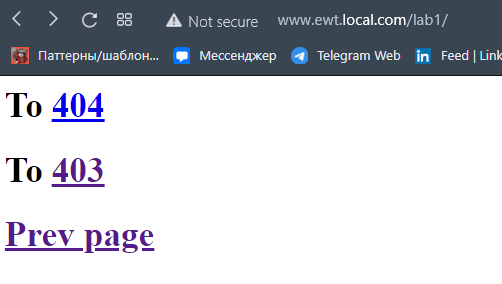
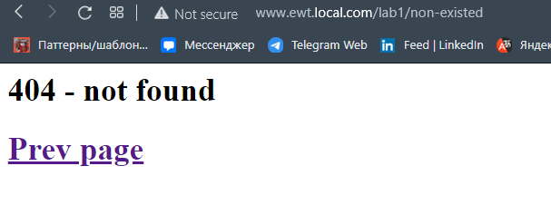
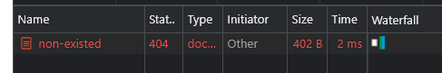
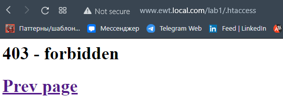
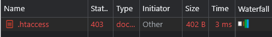

Задание
=
https://github.com/Virotor/ERGONOMIC-WEB-TECHNOLOGIES/blob/main/LWW1.pdf

Ход работы
=
1. Установка Apache24
2. Изменение в файле .\Apache24\conf\httpd.conf на место установки Apache24
3. Создание хоста в папке .\Apache24\conf\extra\httpd-vhosts.conf
```angular2html
<VirtualHost *:80>
	DocumentRoot "C:/Users/Uladzislau_Lohvin/projects/ewt"
	ServerName www.ewt.local.com
	<Directory "C:/Users/Uladzislau_Lohvin/projects/ewt">
		Options Indexes FollowSymLinks Includes ExecCGI
		AllowOverride All
		Require all granted
	</Directory>
</VirtualHost>

```
4. В файле .\Apache24\conf\httpd.conf проверить наличие
```angular2html
# Virtual hosts
Include conf/extra/httpd-vhosts.conf
```
5. Создание файлов .htaccess, index.html, not-found.html, forbidden.html
```angular2html
//содержимое .htaccess
ErrorDocument 404 /lab1/not-found.html
ErrorDocument 403 /lab1/forbidden.html
```
6. Добавить ```127.0.0.1   www.ewt.local.com``` в файл C:\Windows\System32\drivers\etc\hosts
7. Запуск сервера .\Apache24\bin\httpd.exe
8. 
9. 
10. 
