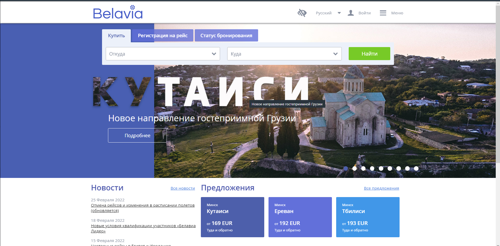
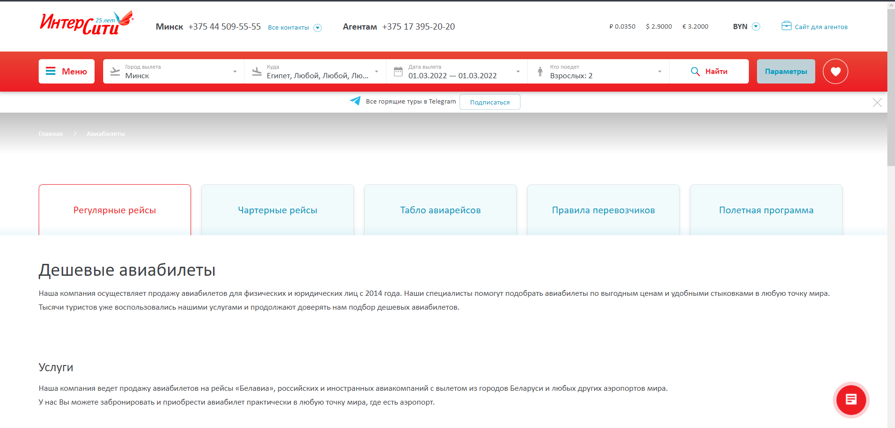
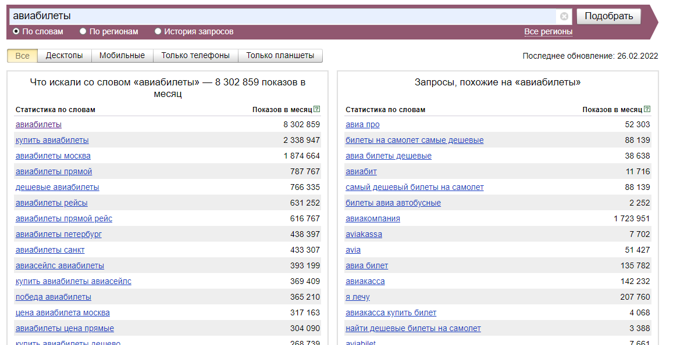

# Разработка сайта по продаже авиабилетов "AviaTrades"

-----------------------------

1. Правило 5W:

   + What: дешёвые авиабилеты;
   + Who: потребитель может быть любого пола, социальный статус выше среднего, совершеннолетние;
   + Why: для путешествий (причины разные: рабочие перелёты, отдых и т.д.);
   + When: покупка авибилетов не зависит от времени суток, но чаще билеты приобретаются во время праздников, отпусков и т.п.;
   + Where: сайт.

 Исходя из правила можно сделать вывод, что целевой аудиторией сайта будут являться пользователи от 18 до 60 лет с достатком выше среднего.

2. Недостатки конкурирующих приложений: 
*  https://belavia.by - Шрифт не сочетается и сливается с фоном. Кликабельные фразы зачастую написаны обычным шрифтом и лишь подчёркнуты из-за чего непонятно, что по ним можно перейти.
   
*  https://intercity.by/avia/ - Ярко красный режущий глаз цвет. Мелкие иконки, сложно попасть. Много свободного пространства.
   
*  https://tickets.by - Кнопки сливаются с фоном. Реклама на четверть экрана.

3. Анализ запросов Yandex

Как видно из результатов, топ-3 запроса по данной теме:

+ авиабилеты,
+ купить авиабилеты,
+ авиабилеты прямой.   
Суммарное количество показов превышает 12 млн.

4. User Stories:
   * Как пользователь, я хочу иметь удобную форму для поиска авиабилетов
   * Как пользователь, я хочу видеть несколько подходящих мне вариантов
   * Как пользователь, я хочу фильтровать подходящие мне варианты по различным критериям (например цена, кол-во пересадок и т.д.)
   * Как пользователь, я хочу видеть цену и время полёта
   * Как пользователь, я хочу видеть цены на соседние даты полёта
  

5. Best-At
   * Цветовая палитра (не будет незаметных кнопок, все ссылки подсвечены)
   * Отсутствие лишнего текста
   * Отображение необходимой информации в авиабилетах

6. Ссылка на figma:
https://www.figma.com/file/bPLbeZ6kCc2RTnl0mY1O0Y/Untitled?node-id=0%3A1

[AviaTrades](AviaTrades.pdf) в PDF